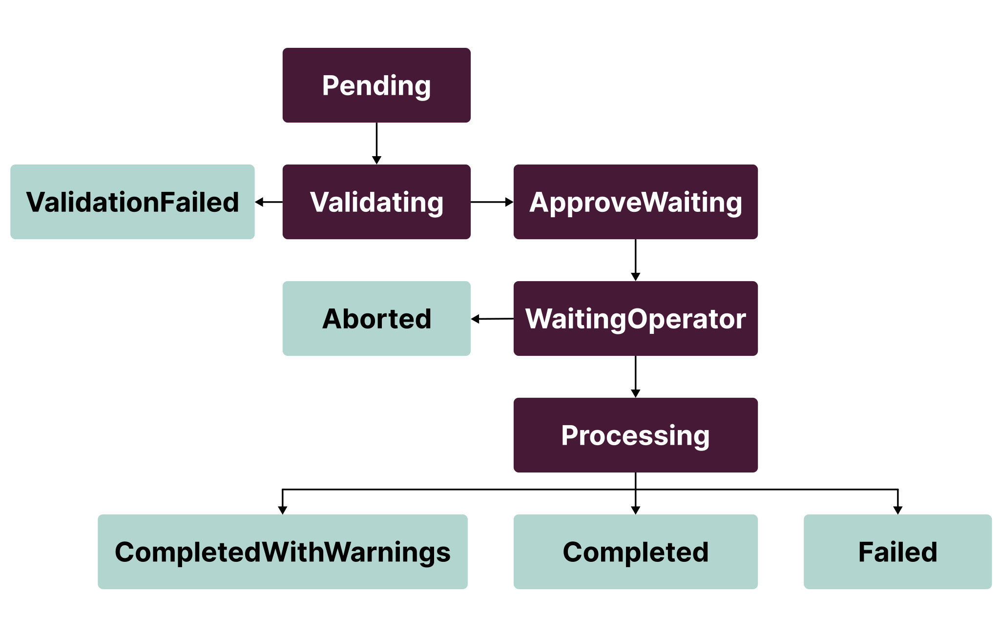

<a id="cephosdremovetask-cephosdremovetask-custom-resource"></a>
# CephOsdRemoveTask custom resource

This section describes the `CephOsdRemoveTask` custom resource specification.
For the procedure workflow, see [Creating a Ceph OSD remove task](../../ops-guide/lcm/create-task-workflow.md#create-task-workflow-creating-a-ceph-osd-remove-task).

<a name="cephosdremovetask-spec-parameters"></a>
## Spec parameters

- `nodes` - Map of Kubernetes nodes that specifies how to remove Ceph OSDs: by host-devices or OSD IDs. For details, see [Nodes parameters](#cephosdremovetask-nodes-parameters).
- `approve` - Flag that indicates whether a request is ready to execute removal. Can only be manually enabled by the Operator. Defaults to `false`.
- `resolved` - Optional. Flag that marks a finished request, even if it failed, to keep it in historydo not block any further operations.

<a name="cephosdremovetask-nodes-parameters"></a>
### Nodes parameters

- `completeCleanUp` - Flag used to clean up an entire node and drop it from the CRUSH map.
  Mutually exclusive with `cleanupByDevice` and `cleanupByOsd`.
- `dropFromCrush` - Flag which is the same to CompleteCleanup, but without device cleanup on node
  May be useful when node is going to be reprovisioned and no need to spend time for device cleanup.
- `cleanupByDevice` - List that describes devices to clean up by name or device symlink as they
  were specified in Rook `CephCluster` (or Pelagia `CephDeployment`). Mutually exclusive with
  `completeCleanUp` and `cleanupByOsd`. Includes the following parameters:

    - `device` - Physical device name, e.g. `sdb`, `/dev/nvme1e0`, or
      device symlink (`by-path` or `by-id`), e.g. `/dev/disk/by-path/pci-0000:00:1c.5`
      or `/dev/disk/by-id/scsi-SATA_HGST_HUS724040AL_PN1334PEHN18ZS`.
    - `skipDeviceCleanup` - Optional. Flag that indicates whether to skip the device cleanup.
      Defaults to `false`. If set to `true`, the device will not be cleaned up, but
      OSDs running on this device will be removed from the CRUSH map and deleted.

    !!! warning

        We do not recommend using device name or device `by-path` symlink in the `cleanupByDevice` field
        as these identifiers are not persistent and can change at node boot. Remove
        Ceph OSDs with device `by-id` symlinks or use `cleanupByOsd` instead.

- `cleanupByOsd` - List of Ceph OSD IDs to remove. Mutually exclusive with
  `completeCleanUp` and `cleanupByDevice`. Includes the following parameters:

    - `id` - Ceph OSD ID to remove.
    - `skipDeviceCleanup` - Optional. Flag that indicates whether to skip the device cleanup.
      Defaults to `false`. If set to `true`, the device will not be cleaned up, but
      OSDs running on this device will be removed from the CRUSH map and deleted.

- `cleanupStrayPartitions` - Flag used to for cleaning disks with osd lvm partitions
  which not belong to current cluster, for example, when disk was not cleaned up previously.

??? "Example of `CephOsdRemoveTask` with `spec.nodes`"

    ```yaml
    apiVersion: lcm.mirantis.com/v1alpha1
    kind: CephOsdRemoveTask
    metadata:
      name: remove-osd-task
      namespace: pelagia
    spec:
      nodes:
        "node-a":
          completeCleanUp: true
        "node-b":
          cleanupByOsd:
          - id: 1
          - id: 15
          - id: 25
        "node-c":
          cleanupByDevice:
          - device: "sdb"
          - device: "/dev/disk/by-path/pci-0000:00:1c.5"
          - device: "/dev/disk/by-id/scsi-SATA_HGST_HUS724040AL_PN1334PEHN18ZS"
        "node-d":
          dropFromCrush: true
    ```

The example above includes the following actions:

* For `node-a`, full cleanup, including all OSDs on the node, node drop from
  the CRUSH map, and cleanup of all disks used for Ceph OSDs on this node.
* For `node-b`, cleanup of Ceph OSDs with IDs `1`, `15`, and `25`
  along with the related disk information.
* For `node-c`, cleanup of the device with name `sdb`, the device with
  path ID `/dev/disk/by-path/pci-0000:00:1c.5`, and the device with `by-id`
  `/dev/disk/by-id/scsi-SATA_HGST_HUS724040AL_PN1334PEHN18ZS`,
  dropping of OSDs running on these devices.
* For `node-d`, cleanup, including all OSDs on the node, node drop from
  the CRUSH map but skip cleanup of all disks used for Ceph OSDs on this node.

<a name="cephosdremovetask-status-fields"></a>
## Status fields

- `phase` - Describes the current task phase.
- `phaseInfo` - Additional human-readable message describing task phase.
- `removeInfo` - The overall information about the Ceph OSDs to remove: final removal map, issues, and warnings. Once the `Processing` phase succeeds, `removeInfo` will be extended with the removal status for each node and Ceph OSD. In case of an entire node removal, the status will contain the status itself and an error message, if any.
- `messages` - Informational messages describing the reason for the request transition to the next phase.
- `conditions` - History of spec updates for the request.

`CephOsdRemoveTask` phases are moving in the following order:



Here are the following **final** phases:

- `ValidationFailed` - The task is not valid and cannot be processed.
- `Aborted` - The task detected inappropriate Rook `CephCluster` spec changes after receiving approval.
- `Completed` - The task is successfully completed.
- `CompletedWithWarnings` - The task is completed but some steps are skipped.
- `Failed` - The task is failed on one of the steps.

<a name="cephosdremovetask-remove-info-fields"></a>
### Remove info fields

- `cleanupMap` - Map of desired nodes and devices to clean up. Based on this map, the cloud operator decides whether to approve the current task or not. After approve, it will contain all statuses and errors happened during cleanup.
- `issues` - List of error messages found during validation or processing phases
- `warnings` - List of non-blocking warning messages found during validation or processing phases

`cleanupMap` is a map of nodes to devices contains the following fields:

- `completeCleanup` - Flag that indicates whether to perform a full cleanup of the node.
- `dropFromCrush` - Flag that indicates whether to drop the node from the CRUSH map without node cleanup.
- `osdMapping` - Map of Ceph OSD IDs to the device names or symlink used for the Ceph OSD. It includes device info and
  statuses of Ceph OSD remove itself, Rook Ceph OSD deployment remove, Ceph OSD device cleanup job.

    ??? "`CephOsdRemoveTask` `osdMapping` example output"

        ```yaml
        status:
          removeInfo:
            cleanupMap:
              "node-a":
                completeCleanUp: true
                osdMapping:
                  "2":
                    deviceMapping:
                      "sdb":
                        path: "/dev/disk/by-path/pci-0000:00:0a.0"
                        partition: "/dev/ceph-a-vg_sdb/osd-block-b-lv_sdb"
                        type: "block"
                        class: "hdd"
                        zapDisk: true
                  "6":
                    deviceMapping:
                      "sdc":
                        path: "/dev/disk/by-path/pci-0000:00:0c.0"
                        partition: "/dev/ceph-a-vg_sdc/osd-block-b-lv_sdc-1"
                        type: "block"
                        class: "hdd"
                        zapDisk: true
                  "11":
                    deviceMapping:
                      "sdc":
                        path: "/dev/disk/by-path/pci-0000:00:0c.0"
                        partition: "/dev/ceph-a-vg_sdc/osd-block-b-lv_sdc-2"
                        type: "block"
                        class: "hdd"
                        zapDisk: true
        ```

- `nodeIsDown` - Flag that indicates whether the node is down.
- `volumeInfoMissed` - Flag that indicates whether `disk-daemon` collected device info or not.
- `hostRemoveStatus` - Node removal status if node is marked for complete cleanup.

<a name="cephosdremovetask-remove-info-examples"></a>
### Remove info examples

??? "Example of `status.removeInfo` after successful `Validation`"

    ```yaml
    status:
      removeInfo:
        cleanupMap:
          "node-a":
            completeCleanUp: true
            osdMapping:
              "2":
                deviceMapping:
                  "sdb":
                    path: "/dev/disk/by-path/pci-0000:00:0a.0"
                    partition: "/dev/ceph-a-vg_sdb/osd-block-b-lv_sdb"
                    type: "block"
                    class: "hdd"
                    zapDisk: true
              "6":
                deviceMapping:
                  "sdc":
                    path: "/dev/disk/by-path/pci-0000:00:0c.0"
                    partition: "/dev/ceph-a-vg_sdc/osd-block-b-lv_sdc-1"
                    type: "block"
                    class: "hdd"
                    zapDisk: true
              "11":
                deviceMapping:
                  "sdc":
                    path: "/dev/disk/by-path/pci-0000:00:0c.0"
                    partition: "/dev/ceph-a-vg_sdc/osd-block-b-lv_sdc-2"
                    type: "block"
                    class: "hdd"
                    zapDisk: true
          "node-b":
            osdMapping:
              "1":
                deviceMapping:
                  "sdb":
                    path: "/dev/disk/by-path/pci-0000:00:0a.0"
                    partition: "/dev/ceph-b-vg_sdb/osd-block-b-lv_sdb"
                    type: "block"
                    class: "ssd"
                    zapDisk: true
              "15":
                deviceMapping:
                  "sdc":
                    path: "/dev/disk/by-path/pci-0000:00:0b.1"
                    partition: "/dev/ceph-b-vg_sdc/osd-block-b-lv_sdc"
                    type: "block"
                    class: "ssd"
                    zapDisk: true
              "25":
                deviceMapping:
                  "sdd":
                    path: "/dev/disk/by-path/pci-0000:00:0c.2"
                    partition: "/dev/ceph-b-vg_sdd/osd-block-b-lv_sdd"
                    type: "block"
                    class: "ssd"
                    zapDisk: true
          "node-c":
            osdMapping:
              "0":
                deviceMapping:
                  "sdb":
                    path: "/dev/disk/by-path/pci-0000:00:1t.9"
                    partition: "/dev/ceph-c-vg_sdb/osd-block-c-lv_sdb"
                    type: "block"
                    class: "hdd"
                    zapDisk: true
              "8":
                deviceMapping:
                  "sde":
                    path: "/dev/disk/by-path/pci-0000:00:1c.5"
                    partition: "/dev/ceph-c-vg_sde/osd-block-c-lv_sde"
                    type: "block"
                    class: "hdd"
                    zapDisk: true
                  "sdf":
                    path: "/dev/disk/by-path/pci-0000:00:5a.5",
                    partition: "/dev/ceph-c-vg_sdf/osd-db-c-lv_sdf-1",
                    type: "db",
                    class: "ssd"
    ```

During the `Validation` phase, the provided information was validated and
reflects the final map of the Ceph OSDs to remove:

* For `node-a`, Ceph OSDs with IDs `2`, `6`, and `11` will be removed
  with the related disk and its information: all block devices, names, paths,
  and disk class.
* For `node-b`, the Ceph OSDs with IDs `1`, `15`, and  `25` will be
  removed with the related disk information.
* For `node-c`, the Ceph OSD with ID `8` will be removed, which is placed
  on the specified `sdb` device. The related partition on the `sdf` disk,
  which is used as the BlueStore metadata device, will be cleaned up keeping
  the disk itself untouched. Other partitions on that device will not be
  touched.

??? "Example of `removeInfo` with `removeStatus` succeeded"

    ```yaml
    status:
      removeInfo:
        cleanupMap:
          "node-a":
            completeCleanUp: true
            hostRemoveStatus:
              status: Removed
            osdMapping:
              "2":
                removeStatus:
                  osdRemoveStatus:
                    status: Removed
                  deploymentRemoveStatus:
                    status: Removed
                    name: "rook-ceph-osd-2"
                  deviceCleanUpJob:
                    status: Finished
                    name: "job-name-for-osd-2"
                deviceMapping:
                  "sdb":
                    path: "/dev/disk/by-path/pci-0000:00:0a.0"
                    partition: "/dev/ceph-a-vg_sdb/osd-block-b-lv_sdb"
                    type: "block"
                    class: "hdd"
                    zapDisk: true
    ```

??? "Example of `removeInfo` with `removeStatus` failed"

    ```yaml
    status:
      removeInfo:
        cleanupMap:
          "node-a":
            completeCleanUp: true
            osdMapping:
              "2":
                removeStatus:
                  osdRemoveStatus:
                    error: "retries for cmd ‘ceph osd ok-to-stop 2’ exceeded"
                    status: Failed
                deviceMapping:
                  "sdb":
                    path: "/dev/disk/by-path/pci-0000:00:0a.0"
                    partition: "/dev/ceph-a-vg_sdb/osd-block-b-lv_sdb"
                    type: "block"
                    class: "hdd"
                    zapDisk: true
    ```

??? "Example of `removeInfo` with `removeStatus` failed by timeout"

    ```yaml
    status:
      removeInfo:
        cleanupMap:
          "node-a":
            completeCleanUp: true
            osdMapping:
              "2":
                removeStatus:
                  osdRemoveStatus:
                    error: Timeout (30m0s) reached for waiting pg rebalance for osd 2
                    status: Failed
                deviceMapping:
                  "sdb":
                    path: "/dev/disk/by-path/pci-0000:00:0a.0"
                    partition: "/dev/ceph-a-vg_sdb/osd-block-b-lv_sdb"
                    type: "block"
                    class: "hdd"
                    zapDisk: true
    ```

In case of failures similar to the examples above, review the `pelagia-lcm-controller` logs and both statuses of Rook `CephCluster` and Pelagia `CephDeploymentHealth`.
Such failures may simply indicate timeout and retry issues. If no other issues were found, re-create the request with a new name and skip adding successfully removed Ceph OSDS or Ceph nodes.
