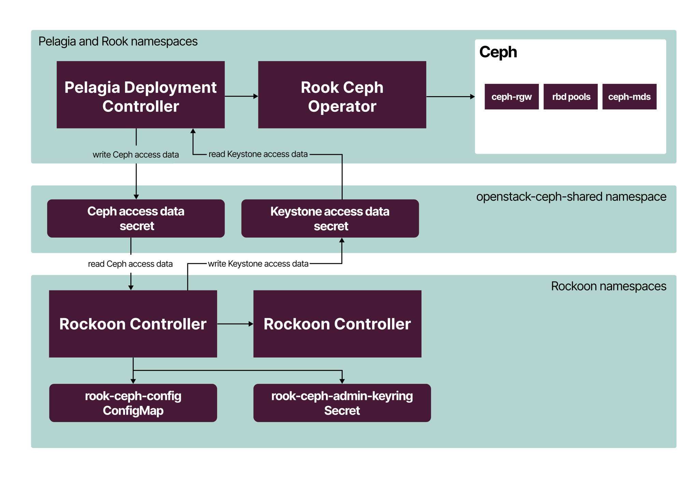

# Pelagia integration with Rockoon

The integration between Pelagia and Rockoon OpenStack Controller
is implemented through the shared Kubernetes `openstack-ceph-shared` namespace. Both
controllers have access to this namespace to read and write the Kubernetes
`kind: Secret` objects.

To integrate Pelagia with Rockoon, all necessary Ceph pools must be specified
in the configuration of the `CephDeployment` custom resource as part of the deployment.
For the required pools, see [Integrate Pelagia with Rockoon](../ops-guide/rockoon/rockoon-integration.md#integrate-pelagia-with-rockoon).

Once the Ceph cluster is deployed, Pelagia Deployment Controller posts the
information required by Rockoon OpenStack services to be properly configured
as a `kind: Secret` object into the `openstack-ceph-shared` namespace.
Rockoon Controller watches this namespace. Once the corresponding
secret is created, Rockoon Controller transforms this secret to the
data structures expected by the OpenStack Helm charts. Even if an OpenStack
installation is triggered at the same time as a Ceph cluster deployment,
Rockoon Controller halts the deployment of the OpenStack services that
depend on Ceph availability until Pelagia Deployment Controller
creates the secret in the shared namespace.

For the configuration of Ceph Object Gateway as an OpenStack Object
Storage, the reverse process takes place. Rockoon Controller waits
for the OpenStack Helm to create a secret with OpenStack Identity
(Keystone) credentials that Ceph Object Gateway must use to validate the
OpenStack Identity tokens, and posts it back to the same
`openstack-ceph-shared` namespace in the format suitable for
consumption by Pelagia. Pelagia Deployment Controller then reads this
secret and reconfigures Ceph Object Gateway accordingly.
